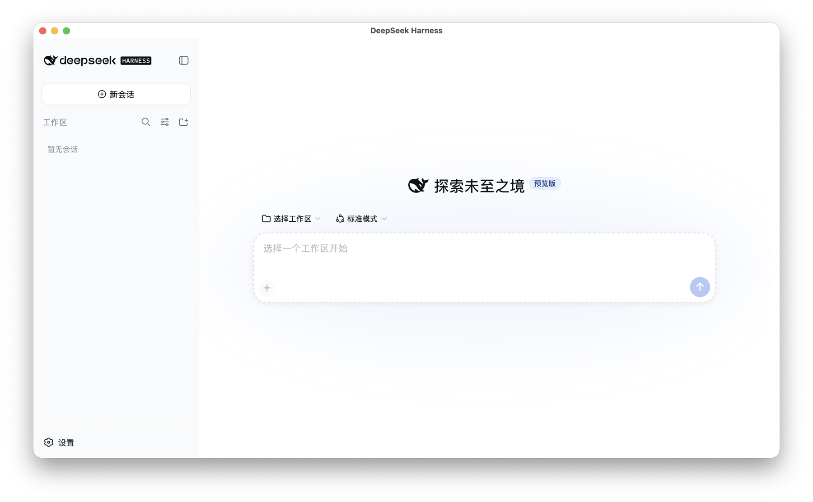
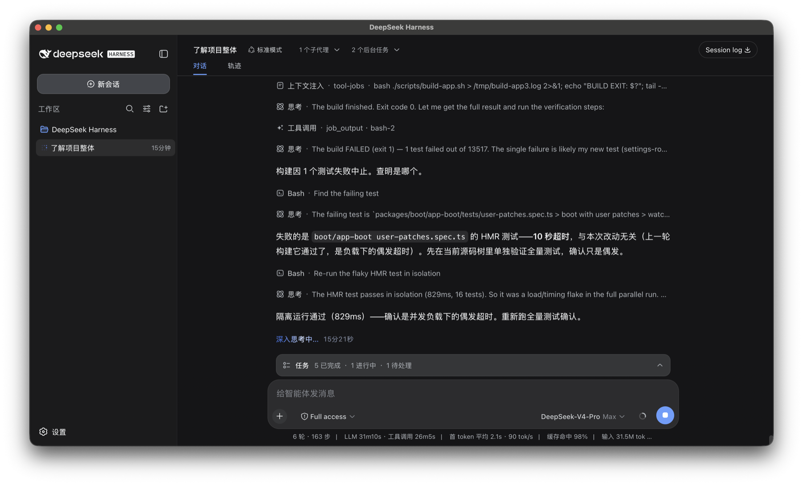
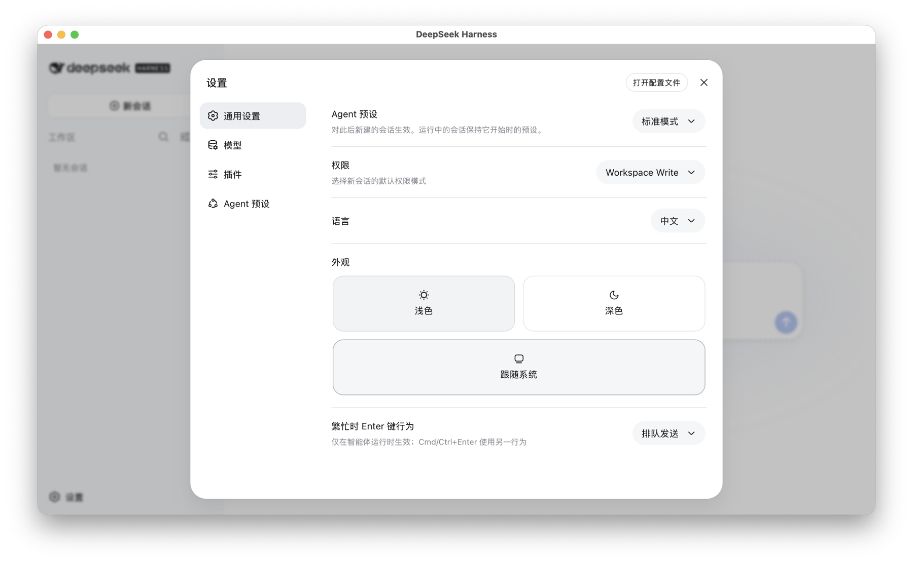
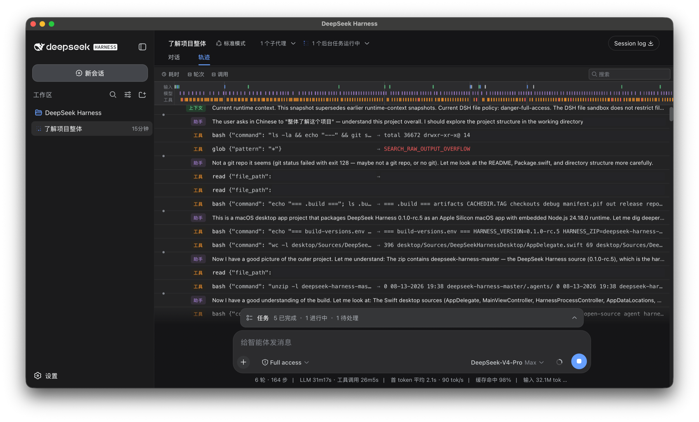
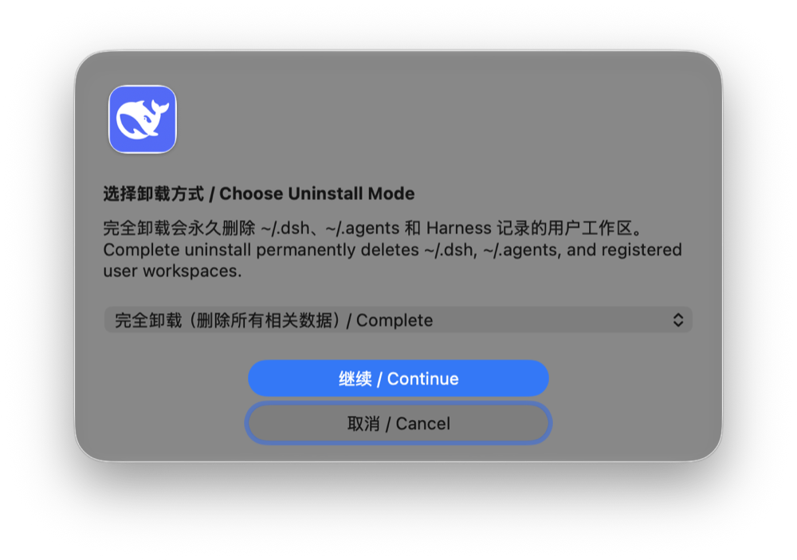
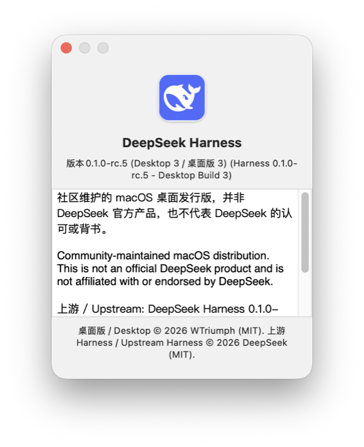

<p align="center">
  
</p>

<h1 align="center">DeepSeek Harness macOS Desktop App</h1>

<p align="center"><strong>DeepSeek Harness macOS 桌面版</strong></p>

<p align="center">
  <a href="#中文">中文</a>
  &nbsp;&middot;&nbsp;
  <a href="#english">English</a>
</p>

<p align="center">
  <a href="https://github.com/WTriumph/DeepSeek-Harness-macOS-Desktop-App/releases"></a>
  
  
  <a href="LICENSE"></a>
</p>

<a id="中文"></a>

由 WTriumph 维护的 [DeepSeek Harness](https://github.com/deepseek-ai/deepseek-harness)
macOS 社区桌面发行版。App 使用 AppKit 与 WKWebView，内置 Node.js 和生产运行时，
双击即可运行，不需要安装 Node、npm 或 pnpm。

当前版本：**Harness 0.1.0-rc.5 (Desktop 3)**

> **非官方声明**：本项目不是 DeepSeek 官方产品，与 DeepSeek 不存在隶属、赞助
> 或背书关系。“DeepSeek”及相关标识归其权利人所有，本项目仅在指代所再分发的
> 开源项目时使用该名称。完整声明见 [NOTICE.md](NOTICE.md)。

## 功能

- 原生 macOS App，启动后直接显示 Harness Web UI
- 内置 arm64 Node.js 24.18.0 与 Harness 生产依赖
- 后端仅监听随机的 `127.0.0.1` 端口
- 中文 Harness UI，支持中文输入法、剪贴板、附件、下载与目录选择
- 保存窗口大小和位置；首次窗口约为屏幕可用宽高的 70%
- 独立桌面数据目录，可选择从旧的 `~/.dsh` 导入副本
- App Only、Standard、Complete 三种双语卸载模式

## 软件展示

<p align="center">
  
</p>
<p align="center"><sub>开箱即用的原生窗口，启动后直接进入 Harness 工作区</sub></p>

<table>
  <tr>
    <td width="50%" align="center">
      <br>
      <sub>深色模式下的会话、工具调用与任务状态</sub>
    </td>
    <td width="50%" align="center">
      <br>
      <sub>语言、权限、Agent 预设与外观设置</sub>
    </td>
  </tr>
</table>

<p align="center">
  <br>
  <sub>轨迹视图将模型、工具和上下文活动集中呈现</sub>
</p>

<table>
  <tr>
    <td width="64%" align="center">
      <br>
      <sub>卸载服务</sub>
    </td>
    <td width="36%" align="center">
      <br>
      <sub>版本与版权归属</sub>
    </td>
  </tr>
</table>

## 相较上游版本的改进与修改

本项目完整保留上游 DeepSeek Harness 的 Agent、模型接入、工具调用、权限确认和会话
的全部能力，重点解决其在 macOS 上作为日常桌面软件使用时的安装、生命周期和数据管理
问题。这里的“上游”指 [`deepseek-ai/deepseek-harness`](https://github.com/deepseek-ai/deepseek-harness)，
不表示本社区发行版获得了 DeepSeek 的官方认可。

| 项目 | 上游 DeepSeek Harness | 本 macOS 桌面版 |
| --- | --- | --- |
| 安装与启动 | 通过 `dsh`/Node.js 环境启动 Web UI | 双击 `.app`；内置固定版本的 Node.js 和生产依赖 |
| macOS 集成 | 浏览器或终端中的 Web 应用 | AppKit + WKWebView、Dock、标准菜单、全屏、窗口记忆和中文输入法 |
| 进程生命周期 | 由启动它的终端或用户管理 | 关闭最后窗口、`Cmd+Q` 和 Dock 退出统一停止 dsh；超时后清理整个进程组 |
| 本地服务 | 由命令行参数决定 | 强制监听随机 `127.0.0.1` 端口，严格校验启动 URL 后才加载 WebUI |
| 数据 | 默认使用命令行版数据位置 | 使用独立 App Support 目录；首次启动可校验并复制 `~/.dsh`，不修改原目录 |
| 界面 | 上游 Web UI | 增加中文本地化修复、完善汉化、原生“设置”入口、启动/掉线/错误状态与外部链接处理 |
| 卸载 | 删除 CLI 或依赖需由用户自行处理 | App Only、Standard、Complete 三种模式，精确列出路径，可选备份并防止宽泛删除 |
| 构建 | 上游源码与常规包管理流程 | 固定源码、Node.js、pnpm 版本及 SHA-256；补丁从全新源码重复应用并测试 |

桌面版没有替换模型、削弱权限确认或绕过 Harness 的安全机制。对 Harness 源码的
修改仅包括生产部署依赖修复、中文界面修复，以及原生菜单打开设置面板所需的事件
接口；完整补丁顺序见 [`patches/harness/series`](patches/harness/series)。

## 系统要求

- macOS 13 或更高版本
- Apple Silicon Mac（arm64）

## 安装

从 [GitHub Releases](https://github.com/WTriumph/DeepSeek-Harness-macOS-Desktop-App/releases)
下载 `DeepSeek-Harness-macos-arm64.zip`，解压后将 App 移入“应用程序”。

公开构建使用 ad-hoc 签名，尚未使用 Apple Developer ID 签名或公证。macOS 首次
启动可能显示 Gatekeeper 提示，可在 Finder 中右键 App 并选择“打开”。不要从未知
镜像下载本 App；发布页会提供 SHA-256 校验值。

## 数据与隐私

桌面版 Harness 数据位于：

```text
~/Library/Application Support/DeepSeek Harness/Harness
```

本桌面壳不会添加遥测，也不会把工作区、日志、API 密钥或凭据上传给 WTriumph。
Harness 连接模型服务时的数据处理行为取决于用户配置的服务提供商。卸载备份可能
包含 API 密钥、凭据、会话和工作区文件，请将备份保存在可信位置。

## 卸载

在 App 菜单选择“卸载 DeepSeek Harness…”，然后选择：

1. **仅移除 App / App Only**：App 移到废纸篓，保留全部数据。
2. **标准卸载 / Standard**：删除 App 与桌面版专属数据，保留 `~/.dsh`、
   `~/.agents` 和用户工作区。
3. **完全卸载 / Complete**：在列出精确路径并要求输入 `DELETE ALL` 后，额外永久
   删除 `~/.dsh`、`~/.agents`，以及 Harness 登记的用户工作区。

完全卸载会删除真实项目文件且无法通过 App 恢复。执行前可创建完整 ZIP 备份。
恢复脚本支持同样的模式和 `--dry-run`：

```sh
./scripts/uninstall-deepseek-harness.sh --mode standard --dry-run
./scripts/uninstall-deepseek-harness.sh --mode complete --dry-run
```

## 构建

固定构建输入见 `config/build-versions.env`：Harness 源 ZIP、Node.js 和 pnpm 都有
固定版本及 SHA-256。Harness 修改以 `patches/harness/series` 中的补丁保存。

```sh
DEVELOPER_DIR=/Applications/Xcode-beta.app/Contents/Developer \
  ./scripts/build-app.sh
```

产物：

```text
dist/DeepSeek Harness.app
dist/DeepSeek-Harness-macos-arm64.zip
```

## 安全与许可证

- 安全问题请按 [SECURITY.md](SECURITY.md) 私密报告，不要在公开 Issue 中粘贴
  API 密钥、日志或工作区文件。
- 本仓库新增的桌面打包、原生外壳、构建和卸载代码：Copyright (c) 2026
  WTriumph，依据仓库根目录的 [MIT License](LICENSE) 发布。
- 再分发的上游 DeepSeek Harness 0.1.0-rc.5：Copyright (c) 2026 DeepSeek，
  依据其 MIT License 使用；原始 ZIP 保持不变，桌面修改以补丁保存。
- “DeepSeek”及相关标识的权利归其各自权利人所有。MIT 许可证不授予商标权，
  本项目名称仅用于说明兼容及再分发对象。
- Node.js 与其他第三方组件保留各自版权和许可证；详见 [NOTICE.md](NOTICE.md)、
  [THIRD-PARTY-NOTICES.txt](desktop/Resources/THIRD-PARTY-NOTICES.txt) 以及 App 内
  `Resources/Licenses`。

---

## English

Community-maintained macOS distribution of
[DeepSeek Harness](https://github.com/deepseek-ai/deepseek-harness), maintained
by WTriumph. The native AppKit and WKWebView application embeds Node.js and the
production runtime, so no Node, npm, or pnpm installation is required.

Current version: **Harness 0.1.0-rc.5 (Desktop 3)**

> **Unofficial distribution:** This project is not an official DeepSeek product
> and is not affiliated with, sponsored by, or endorsed by DeepSeek. "DeepSeek"
> and related marks belong to their respective owners and are used only to
> identify the redistributed open-source project. See [NOTICE.md](NOTICE.md).

### Features

- Native macOS application that opens directly into the Harness Web UI
- Embedded arm64 Node.js 24.18.0 and production-only Harness dependencies
- Backend bound only to a random `127.0.0.1` port
- Chinese Harness UI with IME, clipboard, attachments, downloads, and folders
- Window size and position persistence; first window uses about 70% of the
  available screen width and height
- Isolated desktop data with optional copy migration from legacy `~/.dsh`
- Bilingual App Only, Standard, and Complete uninstall modes

### Improvements and Changes from Upstream

This project preserves the upstream DeepSeek Harness agent, model-provider,
tool-calling, approval, and session capabilities. Its changes focus on making
Harness installable and manageable as an everyday macOS application. Here,
"upstream" means
[`deepseek-ai/deepseek-harness`](https://github.com/deepseek-ai/deepseek-harness);
it does not imply that DeepSeek endorses this community distribution.

| Area | Upstream DeepSeek Harness | This macOS desktop distribution |
| --- | --- | --- |
| Install and launch | Starts the Web UI through `dsh` and a Node.js environment | Double-clickable `.app` with pinned Node.js and production dependencies |
| macOS integration | Web application used from a browser or terminal | AppKit + WKWebView, Dock, standard menus, full screen, window persistence, and CJK IME |
| Process lifecycle | Managed by the launching terminal or user | Window close, `Cmd+Q`, and Dock quit stop dsh consistently; a timeout cleans up the process group |
| Local service | Controlled by CLI arguments | Bound to a random `127.0.0.1` port; the startup URL is strictly validated before WebUI loading |
| Data | Uses the CLI data location | Isolated App Support data with validated copy migration from `~/.dsh`; the source remains untouched |
| Interface | Upstream Web UI | Chinese localization fixes, native Settings entry, startup/disconnect/error states, and external-link handling |
| Uninstall | CLI and dependencies are removed manually | App Only, Standard, and Complete modes with exact paths, optional backup, and broad-delete safeguards |
| Reproducibility | Upstream source and package-manager workflow | Pinned source, Node.js, pnpm, and SHA-256 values; patches apply to a fresh source tree and are tested |

The desktop distribution does not replace models, weaken approval checks, or
bypass Harness security controls. Harness patches are limited to production
deployment dependency fixes, Chinese UI fixes, and the event used by the native
Settings menu. See [`patches/harness/series`](patches/harness/series) for the
complete ordered patch set.

### Requirements and Installation

Requires macOS 13 or later on Apple Silicon. Download
`DeepSeek-Harness-macos-arm64.zip` from
[GitHub Releases](https://github.com/WTriumph/DeepSeek-Harness-macOS-Desktop-App/releases),
extract it, and move the application into Applications.

Public builds are ad-hoc signed and are not Apple Developer ID signed or
notarized. Gatekeeper may require the first launch through Finder's **Open**
context-menu action. Download only from the project release page and verify the
published SHA-256 checksum.

### Data, Privacy, and Uninstall

Desktop Harness data is stored at:

```text
~/Library/Application Support/DeepSeek Harness/Harness
```

The desktop shell adds no telemetry and does not upload workspaces, logs, API
keys, or credentials to WTriumph. Data sent to configured model providers is
governed by those providers. Uninstall backups can contain credentials,
sessions, and workspace files and must be stored securely.

The application offers three uninstall modes:

1. **App Only** moves the App to Trash and preserves all data.
2. **Standard** removes the App and Desktop-owned data while preserving
   `~/.dsh`, `~/.agents`, and user workspaces.
3. **Complete** lists exact paths and requires `DELETE ALL`, then permanently
   removes `~/.dsh`, `~/.agents`, and Harness-registered workspaces as well.

Complete uninstall deletes real project files and cannot be reversed by the
App. An optional complete ZIP backup is available before deletion.

### Building

Pinned inputs and SHA-256 values are in `config/build-versions.env`; upstream
changes are reproducible patches in `patches/harness/series`.

```sh
DEVELOPER_DIR=/Applications/Xcode-beta.app/Contents/Developer \
  ./scripts/build-app.sh
```

Outputs:

```text
dist/DeepSeek Harness.app
dist/DeepSeek-Harness-macos-arm64.zip
```

### Security and Licensing

- Follow [SECURITY.md](SECURITY.md) for private vulnerability reporting. Never
  post API keys, private logs, or workspace files in public issues.
- New desktop packaging, native shell, build, and uninstall code in this
  repository: Copyright (c) 2026 WTriumph, released under the repository's
  [MIT License](LICENSE).
- Redistributed upstream DeepSeek Harness 0.1.0-rc.5: Copyright (c) 2026
  DeepSeek, used under its MIT License. The original ZIP remains unchanged and
  desktop modifications are stored as patches.
- "DeepSeek" and related marks belong to their respective owners. The MIT
  License does not grant trademark rights; the name is used only to identify
  compatibility with and redistribution of the upstream project.
- Node.js and other third-party components retain their own copyrights and
  licenses. See [NOTICE.md](NOTICE.md),
  [THIRD-PARTY-NOTICES.txt](desktop/Resources/THIRD-PARTY-NOTICES.txt), and the
  bundled `Resources/Licenses`.
